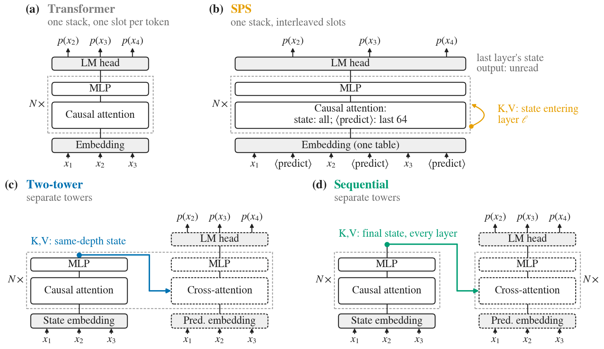
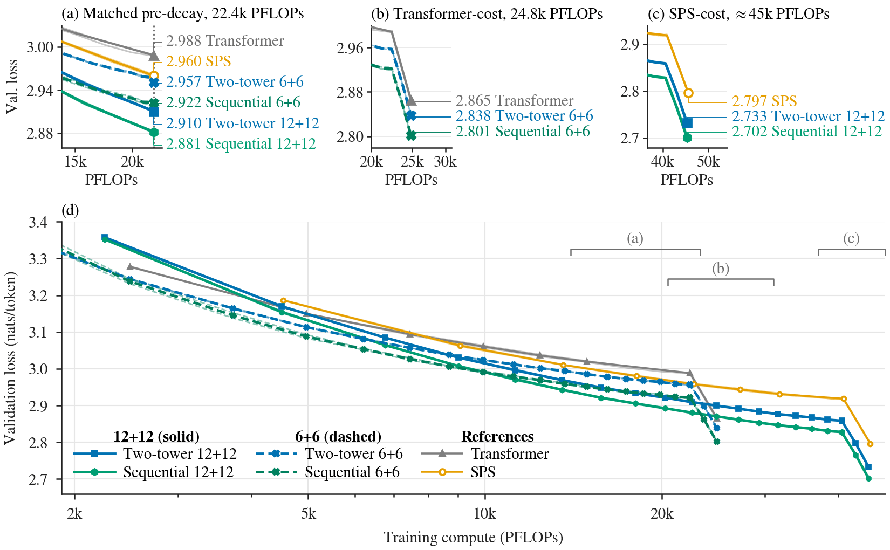

# Which State Should Prediction Read?

Code, configs and results for the paper *Which State Should Prediction Read? A Mechanistic
Analysis of State–Prediction Separation* (Ryan Kim, 2026).

**Paper:** arXiv link coming soon | **Checkpoints:** [Hugging Face, `ryankim17920/mechanistic-sps`](https://huggingface.co/ryankim17920/mechanistic-sps)

<p align="center">
  
</p>

**Figure 1.** Architectures: (a) Transformer, (b) interleaved SPS slots, (c) Two-tower's same-depth
read, and (d) Sequential's final-state read. Layer norms and residual connections are omitted.
In (b), the 64-token window restricts prediction-slot keys only; state slots see all earlier
state slots. Dashed boxes mark prediction towers, and grey dashed frames mark repeated layers.

State–Prediction Separation (SPS) improves language modeling by giving persistent state and
next-token prediction separate token slots, but both slots share all weights, so it is unclear
whether and how their roles specialize. We give the two streams separate weights and trace how
information is written and read. State concentrates predecessor (previous-token) information,
while prediction does more of the induction matching; ablating state's previous-token heads
selectively weakens prediction's retrieval, and restricting prediction to the deepest state
levels costs far less than restricting it to the shallowest, yet SPS never reads its top state
layer. This motivates a *final-state read*, in which every prediction layer reads the final
state (the Sequential model), compared against a *same-depth read* (Two-tower) at matched
parameters and FLOPs.

## Key result

**Sequential 6+6 matches the raw Transformer's pre-learning-rate-decay loss with 2.2× fewer
training FLOPs** (2.11–2.25× per seed pair; it reaches the Transformer's pre-decay validation
loss, 2.988 nats/token as a two-seed mean at the Transformer's 18.0B-token checkpoint, after
8.0–8.5B tokens, at identical FLOPs per token; `python scripts/analysis/predecay_match.py`
recomputes this from the committed ledger).

Giving every prediction layer the final state (Sequential) instead of the same-depth state
(Two-tower) lowers validation loss at matched parameters and FLOPs. With each tower as deep as the
Transformer (12+12), Sequential lowers seed-mean loss by 0.031 nats/token, and the 6+6 pair improves
by 0.037. A smaller Sequential model (6+6) comes 0.064 nats/token below the Transformer at matched
non-embedding parameters and FLOPs, and within 0.005 nats/token of SPS at 55% of its FLOPs.

<p align="center">
  
</p>

Validation loss (nats/token; ± is half the range over the two seeds), from the paper's Sequential versus Two-tower comparison table:

| Model | Two-tower | Sequential | Δ (Seq. − TT) | Non-emb. params (M) | Total params (M) | GFLOPs/token |
|---|---|---|---|---|---|---|
| Separate weights, 12+12 | 2.733 (±.001) | 2.702 (±<.001) | −0.031 | 184.1 | 300 | 0.751 |
| Separate weights, 6+6 | 2.838 (±<.001) | 2.801 (±.002) | −0.037 | 92.0 | 208 | 0.414 |
| Transformer | 2.865 (±.003) | | | 92.0 | 169 | 0.414 |
| SPS | 2.797 (±.001) | | | 92.0 | 169 | 0.756 |

The Transformer and SPS rows are single models, not Two-tower/Sequential pairs.

---

The repository holds everything needed to go from an empty machine to the paper's numbers:
data preparation, the 39 training configs, the evaluation that produces the paper's loss
numbers, the analyses, and the figure and table build. The results the paper was built from
are committed too, so every table and figure also rebuilds on a CPU in minutes without any
training.

The model code started from the SPS reference implementation (see `UPSTREAM.md`).

## Setup

System prerequisites: [uv](https://docs.astral.sh/uv/) and a C compiler (`torch.compile`).
Training and the GPU analyses need NVIDIA GPUs (the paper used one node of 8 H100s per
training run).

```bash
uv sync                    # Python 3.10, PyTorch 2.9, pinned in uv.lock
cp .env.example .env       # then set DUALSPS_DATA_ROOT (and optionally DUALSPS_OUT_ROOT)
```

Machine-specific locations come from environment variables, and have no machine-specific
defaults. Every script reads them the same way: from the environment, else from `.env` in
the repo root (a variable set in the environment wins). The python side is
`src/repo_paths.py`, the shell side `scripts/run/env.sh`. A script that needs an unset variable
stops with a message naming it. Rebuilding the tables and figures and running the gates need none.

| Variable | Holds | Default |
|---|---|---|
| `DUALSPS_DATA_ROOT` | tokenized corpus, `<root>/data/fineweb-edu-100bt/{train,val}.bin` | none: required for data, training, evaluation and analyses |
| `DUALSPS_OUT_ROOT` | run outputs, `<root>/out/<run>/`, and the live ledger and wall-clock rows, `<root>/results/` | `DUALSPS_DATA_ROOT` |
| `DUALSPS_LOG_DIR` | training logs, read by `eval_runs.py` for throughput | `<DUALSPS_DATA_ROOT>/logs` |
| `DUALSPS_HF_REPO` | Hugging Face repo of the checkpoints (`hf_export.py` only) | `ryankim17920/mechanistic-sps` |
| `DUALSPS_RESULTS` | paper inputs (ledger, wall-clock, analysis JSONs) | `scripts/analysis/results` |

## Rebuild the tables and figures from the committed results (CPU only)

```bash
make paper     # tables and text numbers -> paper/tables/, figures -> paper/figures/
make check     # golden gates: the rebuilt figures and tables are unchanged, and more
python scripts/analysis/predecay_match.py   # the 2.2x training-FLOP comparison above
```

`make paper` reads only files in git: `scripts/analysis/results/` holds the evaluation
ledger (`ledger.jsonl`), the wall-clock benchmark (`wallclock.jsonl`) and the analysis JSONs,
with provenance in `scripts/analysis/results/SOURCES.md`. `scripts/analysis/README.md`
describes the pipeline and the paper manifest (`scripts/analysis/paper_manifest.yaml`).

`make check` runs the CPU gates described in `gates/README.md` and needs no data, checkpoint
or environment variable: the freeze-and-retrain gates build their frozen source checkpoint
on the fly. With the two trained source runs under `$DUALSPS_OUT_ROOT/out/` (train them, or
download them, below), `make check FRZ=real` also checks the real ones. Some goldens are
host-specific: the training-step gate (G4) is bit-exact only on the same CPU type and thread
count, and the figure gate (G1) depends on the matplotlib install
(`gates/README.md`, "Host"). The figure fonts ship with the repo (`src/plotting/fonts/`).

### Paper artifact to command

Every figure, table and text number of the paper, the command that rebuilds it from the
committed results, and the analysis that produced those results (rerun it from a checkpoint
as in "Analyses and the paper" below). `--outdir` defaults to `paper/figures/` or `paper/tables/`.

| Paper artifact | Rebuild (CPU) | Inputs in `scripts/analysis/results/`, and the script that writes them |
|---|---|---|
| Fig. 1 `fig_teaser` | `python scripts/analysis/paper_figures.py --only fig_teaser` | none (schematic, `fig_arch_paper.py`) |
| Fig. `fig_state_access` | `... paper_figures.py --only fig_state_access` | `a2_knockout_*` (a), `a20_role_probe_*` (b, c) |
| Fig. `fig_read_depth` | `... paper_figures.py --only fig_read_depth` | `a13_read_depth_cap_*` (a), `a12_depth_lesion_*` (b–d) |
| Fig. `fig_frontier` | `... paper_figures.py --only fig_frontier` | `ledger.jsonl` checkpoint ladders (`eval_runs.py`) |
| Fig. `app_ctrl_dist` | `... paper_figures.py --only app_ctrl_dist` | `a9_patching_*` control draws (`a9_patching.py --n-ctrl-draws 100`) |
| Fig. `app_gradcos` | `... paper_figures.py --only app_gradcos` | `a16_grad_orthogonality_*` |
| Fig. `app_depth_split` | `... paper_figures.py --only app_depth_split` | `a12_depth_lesion_*` of Sequential 3+9, 6+6, 9+3 |
| Tabs. `tab_circuit`, `tab_circuit_full` | `python scripts/analysis/make_tables.py` (writes every table) | `a5_induction_*`, `a9_patching_*` |
| Tab. `tab_patching` | same | `a9_patching_*` |
| Tab. `tab_readdepth_full` | same | `a2_knockout_*`, `a2_ctx_knockout_*`, `a13_read_depth_cap_*` |
| Tab. `tab_probe_floors` | same | `a20_role_probe_*` (trained and `--untrained`) |
| Tab. `tab_lesion_mean` | same | `a12_depth_lesion_zero_vs_mean.json` (`a12_compare_ablation.py`) |
| Tab. `tab_roster_full` | same | `ledger.jsonl`, `wallclock.jsonl`, `arch_stats.json` |
| Tab. `tab_efficiency` | same | `wallclock.jsonl` (`bench_wallclock.py`), `arch_stats.json` |
| In-text tables (`tab_2x2`, `tab_model_definitions`, `tab_control_counts`, `tab_finalread`, `tab_token_gain`) | same | ledger, `a9_patching_*`, `g3_final_read_mechanism.py` outputs |
| Text numbers (`paper/tables/numbers.tex`, e.g. `\PrevMassState` 0.71–0.89, `\AblRatio` 1.9–3.0, `\KeepSixtyFour` 0.32–0.40, `\NeverShare` 42.8%, `\NeverGain` 58–61%, `\ImposeSeqOnTwoTowerSix` 0.68) | same (`paper_numbers.py`) | all of the above |
| Pre-decay comparison (2.2×, 2.11–2.25×, 8.0–8.5B tokens, 2.988) | `python scripts/analysis/predecay_match.py` | `ledger.jsonl` |

The few numbers typed directly in the paper text, and where each comes from, are listed in
`scripts/analysis/results/SOURCES.md` ("Numbers typed in the paper text").

## Reproduce from scratch

Run every command below from the repo root, in a shell that has sourced
`scripts/run/env.sh`. It reads `.env`, fills in the defaults of the table above, puts the
venv first on `PATH` and sets `WANDB_MODE=offline` unless you set it:

```bash
source scripts/run/env.sh
mkdir -p "$DUALSPS_LOG_DIR"    # training logs, where eval_runs.py finds them
```

### 1. Data

On a CPU machine with about 64 cores and 200 GB of RAM:

```bash
python src/data/prepare.py system.data_root="$DUALSPS_DATA_ROOT"
```

This tokenizes 36 shards of FineWeb-Edu `sample-100BT` (the first 36 in sorted order,
processed in a seeded shuffled order) with the GPT-2 tokenizer into `train.bin`
(27,089,110,623 tokens) and `val.bin` (13,099,931 tokens). The recipe (Hub revision, shard
selection, seeds, worker count) is `conf/data/fineweb-edu-100bt.yaml`; the output depends on
its worker count, not on the machine's CPU count. The download (~74 GB of parquet) goes to
`$HF_HOME`, or to `<DUALSPS_DATA_ROOT>/.hf_cache` when `HF_HOME` is unset.
The machine needs outbound network access: the shard list and any missing shards come
from the Hugging Face Hub, and tiktoken fetches the GPT-2 BPE files from openaipublic on first use.
`docs/REPRODUCIBILITY.md` covers the corpus and the data order. `data/MANIFEST.json` records
the sha256 of both files; compare them with

```bash
python -c "import json; [print(f['sha256'], n) for n, f in json.load(open('data/MANIFEST.json'))['files'].items()]" \
    > /tmp/corpus.sha256
(cd $DUALSPS_DATA_ROOT/data/fineweb-edu-100bt && sha256sum -c /tmp/corpus.sha256)
```

### 2. Training

**Smoke test first.** `make smoke` trains every model family for 3 steps through
`scripts/train.py` on CPU at reduced size (about a minute) to show training runs;
`make smoke GPU=1` does the same on one GPU at full size.

On a multi-GPU node, a few optimizer steps show that data loading, the model, the
compiled step, evaluation and checkpointing all work, without a full run.
Point the output root at a scratch directory, so the smoke checkpoint is not picked up
later as a run to resume:

```bash
# 5 steps of 96 x 4,096 tokens on one 8-GPU node
torchrun --standalone --nproc_per_node=8 --no-python scripts/run/rank_shim.sh \
    scripts/train.py +experiment=s_two_tower_seq6_20b \
    system.data_root="$DUALSPS_DATA_ROOT" system.out_root="$PWD/smoke" \
    training.max_tokens=1966080 scheduler.warmup_tokens=786432 scheduler.lr_decay_tokens=786432 \
    training.eval_total_tokens=393216 training.eval_interval_tokens=1966080 logging.wandb_log=false
```

The run ends with a final evaluation and `smoke/out/s_two_tower_seq6_20b/ckpt_tokens_*_final.pt`.
Any config in `conf/experiment/` works the same way. `make check` (gate G4) already runs three
real `train.py` steps of ten model configs on CPU.

One run is one experiment config on one node with 8 GPUs: micro-batch 6 per GPU, 2
accumulation steps, global batch 96 sequences of 4,096 tokens, 20B tokens.
`training.world_size: 8` refuses any other GPU count, because the batch recipe and the
data order depend on the world size (pass `training.world_size=null` for a smoke run on
fewer GPUs). `scripts/run/rank_shim.sh` gives each rank its own node-local Triton/Inductor
cache. The `exp=` line starts the log that `eval_runs.py` later reads throughput from:

```bash
EXP=s_two_tower_seq6_20b
{ echo "exp=$EXP host=$(hostname) start=$(date -Is)"
  torchrun --standalone --nproc_per_node=8 --no-python scripts/run/rank_shim.sh \
      scripts/train.py "+experiment=$EXP" \
      system.data_root="$DUALSPS_DATA_ROOT" system.out_root="$DUALSPS_OUT_ROOT"
} 2>&1 | tee "$DUALSPS_LOG_DIR/${EXP}_$(date +%Y%m%d-%H%M%S).out"
```

Checkpoints go to `<DUALSPS_OUT_ROOT>/out/<EXP>/`. Running the same `EXP` again resumes from
its latest checkpoint. The 39 configs in `conf/experiment/`:

| Model | Configs |
|---|---|
| Transformer | `s_full_attention_20b_fw100` (tied head), `..._untied`, `..._untied_seed2` |
| SPS | `s_sps_w64_20b_fw100{,_seed2,_seed3}` (tied head), `..._untied{,_seed2}` |
| AF-SPS | `s_two_tower_afsps_faithful_20b` |
| Two-tower 12+12 | `s_two_tower_w0_equal_20b{,_seed2,_seed3}`, `..._equal_tiedattn_20b` |
| MLP reallocation | `s_two_tower_w0_s1152p3456_20b` |
| Two-tower 6+6 | `s_two_tower_w0_equal6_20b{,_seed2}` |
| Two-tower 12+6 | `s_two_tower_asym_20b` |
| Sequential 12+12 | `s_two_tower_seq12_20b{,_seed2,_seed3}` |
| Sequential 6+6 | `s_two_tower_seq6_20b{,_seed2}`, `..._seq6_slim_20b{,_seed2}`, `..._seq6_cpause_20b` |
| Sequential 3+9, 9+3 | `s_two_tower_seq3p9_20b`, `s_two_tower_seq9p3_20b` |
| Shared Two-tower | `s_two_tower_w0_shared_20b` |
| Shared Sequential | `s_two_tower_seq12_tied_20b{,_seed2}` |
| Freeze-and-retrain | `s_two_tower_frz_{seq6src,tt6src}_{early,final,post}_20b`, `s_two_tower_frz_seq6src_*_20b_seed2` |

A seed replicate (`_seed2`, `_seed3`) inherits its base config and changes only the
initialization and data-order seeds. One more config, `s_two_tower_afsps_20b`, is not a
paper arm: it is the first AF-SPS run, whose checkpoint ladder feeds the `afsps` arm of
`scripts/analysis/a17_trajectory.py`.

The freeze-and-retrain runs load the frozen state tower from the final checkpoint of the run
named by their `training.freeze_state_from` (`s_two_tower_seq6_20b` or
`s_two_tower_w0_equal6_20b`) under `<DUALSPS_OUT_ROOT>/out/`, which must hold exactly one
`ckpt_tokens_*_final.pt`. Train those two first, then the nine freeze-and-retrain configs:

```bash
for EXP in $(basename -s .yaml conf/experiment/s_two_tower_frz_*.yaml); do
    { echo "exp=$EXP host=$(hostname) start=$(date -Is)"
      torchrun --standalone --nproc_per_node=8 --no-python scripts/run/rank_shim.sh \
          scripts/train.py "+experiment=$EXP" \
          system.data_root="$DUALSPS_DATA_ROOT" system.out_root="$DUALSPS_OUT_ROOT"
    } 2>&1 | tee "$DUALSPS_LOG_DIR/${EXP}_$(date +%Y%m%d-%H%M%S).out"
done
```

### 3. Evaluation

The paper's loss numbers are `val_nll_full_sweep`: one deterministic pass over the whole
validation set, on the final checkpoint. Each ckpt_tokens_* checkpoint is also scored,
for the loss-vs-compute curve. `eval_runs.py` appends one record per run to the live ledger
`<DUALSPS_OUT_ROOT>/results/ledger.jsonl` (or `--ledger PATH`), and exits nonzero if any
run could not be evaluated. It reads throughput from the training logs in
`DUALSPS_LOG_DIR` (the `tee` target above). Each command below needs one GPU.

```bash
scripts/run/eval_shim.sh scripts/dualsps/eval_runs.py s_two_tower_seq6_20b s_two_tower_seq12_20b
python scripts/dualsps/ledger.py --list        # read the live ledger
```

The wall-clock table reads the rows tagged `final_mb12`, which the benchmark appends to the
live `<DUALSPS_OUT_ROOT>/results/wallclock.jsonl`:

```bash
scripts/run/eval_shim.sh scripts/bench_wallclock.py --sweep --reps 2 --mb 12 --tag final_mb12
```

This release has no incremental-decode code, so the benchmark does not time decoding; the
decode timings in the committed snapshot were measured by the code the paper was run with,
and the paper's tables do not read them (`scripts/bench_wallclock.py`, docstring).

The paper is built from the snapshot in `scripts/analysis/results/`, never from the live
files. `make snapshot` copies the live ledger and wall-clock rows over it; then update
`scripts/analysis/results/SOURCES.md`, run `make paper`, and regenerate the G1 golden.

Every GPU script runs through `scripts/run/eval_shim.sh`, which gives the process a fresh
node-local Triton cache (and the analyses refuse to run without it). A Triton cache shared
across jobs on a network filesystem has returned wrong kernels without raising any error.

### 4. Analyses and the paper

The mechanistic analyses (induction, patching, lesions, read depth, role probes) are the
scripts in `scripts/analysis/`, listed with their outputs in `scripts/analysis/README.md`.
The GPU analyses read a run's final checkpoint and write a JSON into
`scripts/analysis/results/`; run them one GPU at a time:

```bash
scripts/run/eval_shim.sh scripts/analysis/a5_induction.py --run <run>    # a2 ... a21
scripts/run/eval_shim.sh scripts/analysis/a17_trajectory.py partA --arm <arm>   # modes partA, partB, ladder
python scripts/analysis/g3_final_read_mechanism.py    # CPU, no arguments; likewise
python scripts/analysis/a12_compare_ablation.py       # these three re-aggregate the
python scripts/analysis/g4_standard_compare.py        # committed JSONs
```

Every script prints its options with `--help`. Then rebuild the tables and figures with
`make paper`, as above. `scripts/run/eval_shim.sh scripts/two_tower/freeze_retrain_check.py` checks the
freeze-and-retrain wiring against the two source checkpoints on one GPU.

### Checkpoints on the Hugging Face Hub

The final checkpoints of the paper's runs are public on the Hugging Face Hub at
[`ryankim17920/mechanistic-sps`](https://huggingface.co/ryankim17920/mechanistic-sps)
(model weights and model config, without optimizer state; the model card lists the runs),
and `hf_export.py` downloads from there by default, with no login. Set `DUALSPS_HF_REPO`
(or pass `--repo`) to use another repo. The downloads go to
`<DUALSPS_OUT_ROOT>/out/<run>/`, where the evaluation, the analyses, the freeze-and-retrain
configs and `make check FRZ=real` look for them:

```bash
python scripts/dualsps/hf_export.py download s_two_tower_seq6_20b        # final checkpoint
python scripts/dualsps/hf_export.py download --all s_two_tower_seq6_20b  # every checkpoint the repo holds
python scripts/dualsps/hf_export.py upload --apply --repo <you>/<repo> s_two_tower_seq6_20b   # your own repo
```

## Layout

| Path | Contents |
|---|---|
| `conf/` | Hydra configs. `conf/experiment/` holds the 39 runs (plus one analysis input) |
| `data/MANIFEST.json` | Shards, token counts and sha256 of the prepared corpus |
| `docs/REPRODUCIBILITY.md` | Corpus, data order, resumed runs |
| `src/modeling/` | Transformer, SPS and two-tower models, attention kernels, tests |
| `src/training/`, `src/data/` | Sampler, checkpointing, data preparation |
| `src/plotting/` | Figure style and the vendored figure fonts (`fonts/`, with their licenses) |
| `scripts/train.py` | Training entry point (Hydra) |
| `scripts/dualsps/` | `eval_runs.py`, `ledger.py` (read the ledger, `--snapshot`), `hf_export.py` |
| `scripts/bench_wallclock.py` | Wall-clock benchmark |
| `scripts/two_tower/freeze_retrain_check.py` | GPU check of the freeze-and-retrain wiring |
| `scripts/analysis/` | Analyses, figure and table generators, `results/` |
| `scripts/run/` | `env.sh` (shell environment), `rank_shim.sh` and `eval_shim.sh` (node-local Triton caches for training and GPU scripts) |
| `gates/` | Golden gates run by `make check` |
| `paper/` | The generated tables (`tables/`, with the text numbers in `numbers.tex`) and figures (`figures/`) |
| `assets/` | README images |

## Tests

```bash
uv run python -m pytest    # CPU; tests marked cuda/triton skip without a GPU
```

## License

MIT (`LICENSE`). The model and training code started from the SPS reference implementation
([lil-lab/sps](https://github.com/lil-lab/sps), see `UPSTREAM.md`), whose MIT license and
copyright notices are kept. The vendored figure fonts in `src/plotting/fonts/` carry their
own licenses.

## Citation

```bibtex
@misc{kim2026whichstate,
  title         = {Which State Should Prediction Read? A Mechanistic Analysis of State--Prediction Separation},
  author        = {Ryan Kim},
  year          = {2026},
  note          = {arXiv preprint coming soon}
}
```

This work builds on SPS:

```bibtex
@misc{monea2026sps,
  title         = {The State-Prediction Separation Hypothesis},
  author        = {Giovanni Monea and Nathan Godey and Kiant\'e Brantley and Yoav Artzi},
  year          = {2026},
  eprint        = {2607.01218},
  archivePrefix = {arXiv},
  primaryClass  = {cs.CL}
}
```
